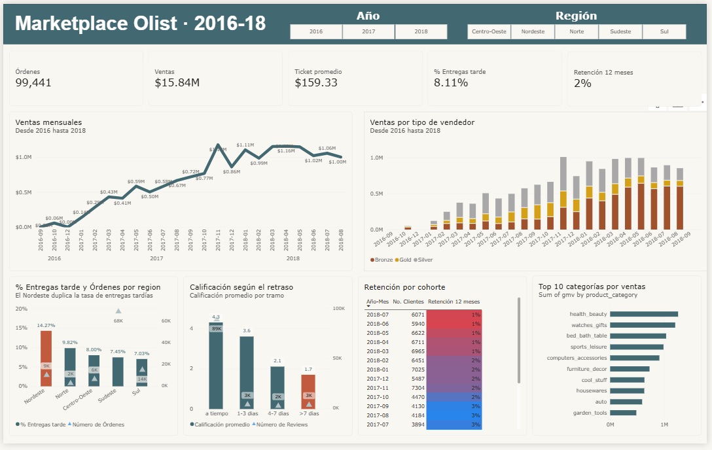
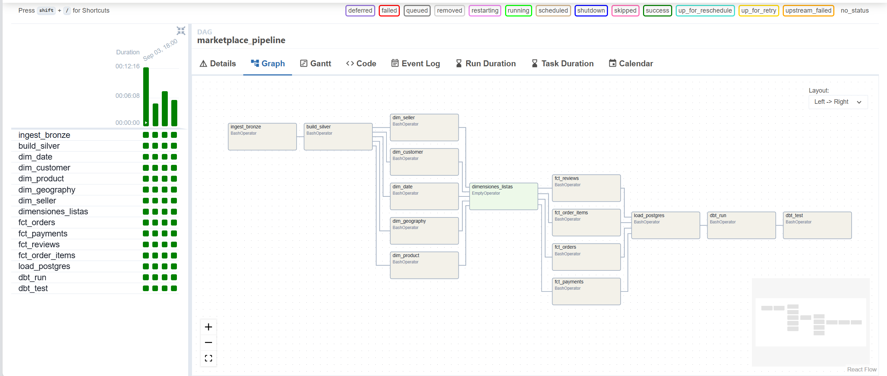
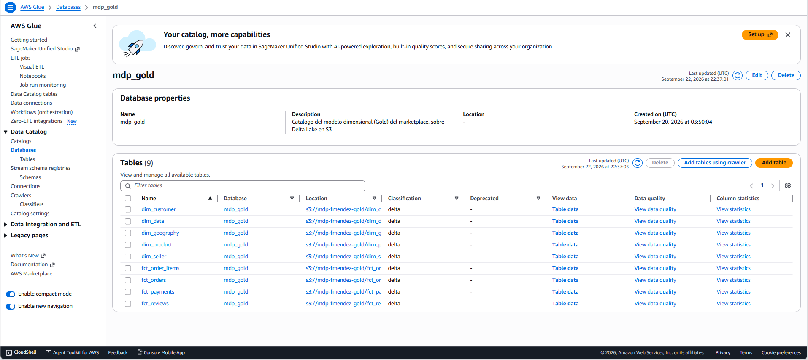
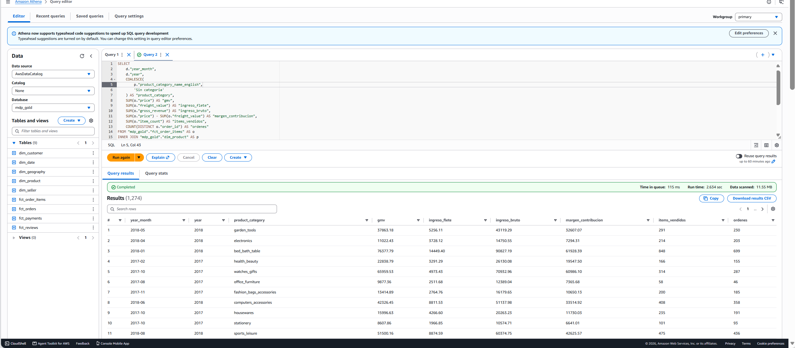
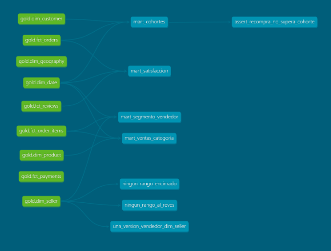

# Marketplace Data Platform

[](https://github.com/MendezFernando/marketplace-data-platform/actions/workflows/ci.yml)

Plataforma de datos completa sobre el dataset real de [Olist](https://www.kaggle.com/datasets/olistbr/brazilian-ecommerce)
(marketplace brasileño, ~100 mil órdenes): de nueve archivos CSV a un modelo dimensional
consultable, con orquestación diaria, pruebas automáticas y tres formas de consumo.

**Del dato crudo a la decisión de negocio, sin pasos manuales.**



---

## Qué resuelve

Un marketplace decide con exportaciones manuales: sin historia, sin métricas consistentes y con
cada área calculando números distintos. Esta plataforma centraliza, versiona y **valida** los
datos para responder preguntas concretas de negocio, documentadas como requisitos con su SLA en
[`docs/00-business-requirements.md`](docs/00-business-requirements.md).

Tres hallazgos que salieron de ella:

| Hallazgo | Dato | Implicación |
|---|---|---|
| El Nordeste incumple la promesa de entrega | **14.3%** de entregas tardías, contra 7.0% en Sul | Estimar la fecha de entrega por región |
| El retraso destruye la satisfacción | La calificación cae de **4.3** (a tiempo) a **1.7** (>7 días) | La logística es un problema de producto, no solo de costo |
| Negocio de adquisición, no de retención | Solo **~3%** de clientes recompra en 12 meses | El gasto en captación no se recupera con recurrencia |

---

## Arquitectura

```
  FUENTES            INGESTA                LAKEHOUSE (Delta Lake sobre S3)            SERVICIO            CONSUMO
┌───────────┐     ┌──────────┐     ┌──────────────────────────────────────────┐   ┌─────────────┐   ┌──────────────┐
│ 9 CSV     │────▶│  Python  │────▶│ BRONZE   crudo, inmutable, particionado  │   │             │──▶│ Power BI     │
│ Olist     │     │  pandas  │     │          por fecha lógica                │   │ PostgreSQL  │   ├──────────────┤
│ 1.5M      │     └──────────┘     ├──────────────────────────────────────────┤   │  esquema    │──▶│ FastAPI      │
│ filas     │                      │ SILVER   limpio, tipado, deduplicado     │──▶│  gold       │   ├──────────────┤
└───────────┘     ┌──────────┐     │          566,358 filas · 8 entidades     │   │             │──▶│ dbt marts    │
                  │ PySpark  │────▶├──────────────────────────────────────────┤   └─────────────┘   └──────────────┘
                  │ + Delta  │     │ GOLD     esquema estrella Kimball        │
                  └──────────┘     │          5 dimensiones + 4 hechos, SCD2  │──▶ Glue Catalog ──▶ Athena (SQL ad hoc)
                                   └──────────────────────────────────────────┘

  ORQUESTACIÓN  Apache Airflow · DAG diario de 14 tareas, reintentos y backfill
  CALIDAD       33 pruebas de datos (dbt) + 22 pruebas unitarias (pytest)
  CI/CD         GitHub Actions · lint y pruebas en cada Pull Request
  NUBE          AWS S3 + Glue Data Catalog + Athena, IAM de privilegio mínimo
  EJECUCIÓN     Docker Compose (PostgreSQL, MinIO, Airflow)
```

**Decisión de fondo:** el código habla la **API de S3**, no con un proveedor concreto. Migrar de
MinIO local a AWS fue cambiar variables de entorno, sin tocar una línea de Python.

📄 [ADR-0001 — Arquitectura lakehouse medallón](docs/adr/0001-arquitectura-lakehouse-medallon.md)

---

## Decisiones de ingeniería

| Decisión | Por qué |
|---|---|
| **Idempotencia en todos los trabajos** | Cada job se parametriza por fecha y sobrescribe su propia salida. Es lo que permite reintentar y reprocesar sin duplicar. |
| **Bronze inmutable** | Silver y Gold se reconstruyen desde Bronze; un error de lógica nunca obliga a volver a pedir datos al origen. |
| **`decimal(12,2)` para dinero, nunca float** | El binario no representa decimales exactos: sobre millones de filas aparecen descuadres de céntimos. |
| **SCD Tipo 2 en `dim_seller`** | Cada venta conserva el segmento que el vendedor tenía **ese día**, con join point-in-time. Los informes históricos son reproducibles. |
| **Miembros desconocidos (`-1`)** | Una clave sin resolver se ve como "Unknown" en vez de desaparecer en el siguiente join. |
| **Nunca almacenar ratios** | Se guardan numerador y denominador; los porcentajes se calculan al consultar y siguen siendo correctos a cualquier nivel de agregación. |
| **`depends_on_past` solo en el SCD2** | Procesar fechas fuera de orden corrompe el historial. En el resto de tareas estorbaría. |
| **IAM de privilegio mínimo** | Se retiró `AdministratorAccess` y se verificó en ambos sentidos: el pipeline funciona, y EC2 / borrar buckets / crear usuarios quedan denegados. |

---

## Evidencia

| Orquestación · DAG diario de 14 tareas | Catálogo · 9 tablas Delta en AWS Glue |
|---|---|
|  |  |

| SQL sin servidores sobre el lakehouse | Linaje y pruebas de dbt |
|---|---|
|  |  |

La consulta de Athena devuelve 1,274 filas en 2.6 s escaneando 11.55 MB: en formato columnar el
costo lo determinan las **columnas leídas**, no las filas devueltas.

---

## Calidad de datos

Dos tipos de prueba, con propósitos distintos:

**33 pruebas de datos (dbt)** — corren con los datos reales en cada carga:
unicidad, integridad referencial, valores aceptados y reglas de negocio propias, por ejemplo que
los clientes que recompran nunca superen el tamaño de su cohorte, y tres que protegen la
integridad del SCD Tipo 2 (una sola versión vigente, sin rangos invertidos, sin traslapes).

**22 pruebas unitarias (pytest)** — corren con datos sintéticos en cada Pull Request.
Varias son de regresión: blindan errores que ya costó encontrar una vez, como que una fecha nula
se resuelva al miembro desconocido en lugar de hacer desaparecer la fila al unir con `dim_date`.

```bash
pytest tests/unit -v          # 22 pruebas
python scripts/run_dbt.py test  # 33 pruebas
```

---

## Cómo ejecutarlo

**Requisitos:** Docker Desktop, Python 3.11, Java 17, y los CSV de Olist en `data/landing/`.

```bash
# 1. Configuración
cp .env.example .env          # completar credenciales locales

# 2. Servicios (PostgreSQL, MinIO, Airflow)
docker compose up -d

# 3. Pipeline completo, un día de datos
python -m marketplace_dp.ingestion.csv_to_bronze --table all --ingestion-date 2018-09-04
python -m marketplace_dp.silver_transformation.run_all_silver --ingestion-date 2018-09-04
python -m marketplace_dp.gold_transformation.dim_seller --as-of 2018-09-04
python -m marketplace_dp.gold_transformation.run_all_gold
python -m marketplace_dp.serving.gold_to_postgres
python scripts/run_dbt.py build

# 4. O todo orquestado: http://localhost:8080  (admin/admin)
#    Disparar `marketplace_pipeline` con fecha lógica 2018-09-04

# 5. API de servicio: http://localhost:8000/docs
uvicorn marketplace_dp.api.main:app --reload --port 8000
```

**Para ejecutar contra AWS en lugar de MinIO**, solo cambia el `.env`:

```diff
- S3_ENDPOINT=http://localhost:9000     # MinIO local
+ S3_ENDPOINT=                          # vacío = AWS S3
```

---

## Estructura

```
src/marketplace_dp/
    common/                  configuración, Spark, lakehouse, logging
    ingestion/               CSV → Bronze (idempotente, por fecha lógica)
    silver_transformation/   8 entidades de negocio limpias
    gold_transformation/     5 dimensiones + 4 tablas de hechos
    serving/                 Gold → PostgreSQL
    api/                     FastAPI sobre los marts
dags/                        DAG diario de Airflow
dbt/                         marts de negocio y pruebas de datos
tests/unit/                  pruebas unitarias
docs/                        requisitos, diseño y decisiones
infra/                       Dockerfile de Airflow, init de PostgreSQL
```

---

## Documentación

| Documento | Contenido |
|---|---|
| [Requisitos de negocio](docs/00-business-requirements.md) | Preguntas de negocio, métricas y SLAs |
| [ADR-0001](docs/adr/0001-arquitectura-lakehouse-medallon.md) | Por qué lakehouse medallón y no un DWH clásico |
| [Diseño de Silver](docs/01-silver-design.md) | Reglas de limpieza y tipado por entidad |
| [Modelo dimensional](docs/02-gold-dimensional-model.md) | Grano, claves, SCD2 y verificación |
| [Migración a AWS](docs/03-aws-cloud.md) | S3, Glue, Athena, costos y privilegio mínimo |

---

## Pendiente

- Streaming con Kafka y Spark Structured Streaming
- Observabilidad: alertas de frescura y detección de volúmenes anómalos
- Despliegue del pipeline dentro de AWS (Glue Jobs o MWAA) e infraestructura como código

---

Datos: [Brazilian E-Commerce Public Dataset by Olist](https://www.kaggle.com/datasets/olistbr/brazilian-ecommerce) (licencia CC BY-NC-SA 4.0).
Proyecto de aprendizaje construido por [Fernando Méndez](https://mendezfernando.github.io).
